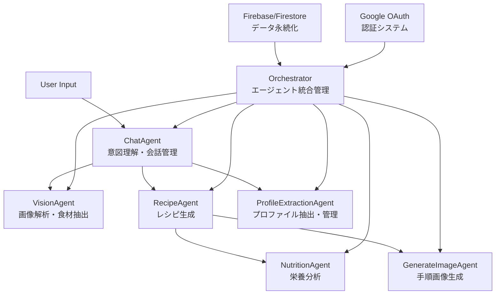

# 🍳 DinnerCam AI Agents

**AI-Powered Recipe Generation with Computer Vision and Multi-Agent System**

DinnerCamは、冷蔵庫の写真から食材を自動認識し、AIエージェントの協調によってレシピ生成・栄養分析・調理手順画像生成を行う次世代料理アシスタントアプリケーションです。


## 📱 このアプリケーションについて

DinnerCamは、日々の料理の悩みを解決するために開発されたAI駆動のアプリケーションです。「冷蔵庫に何があるかわからない」「何を作ろうか迷う」「栄養バランスが気になる」といった課題を、最新のAI技術で解決します。

### 🎯 主な特徴

- **🔍 画像認識**: Google Vertex AI (Gemini Vision)による高精度な食材認識
- **🤖 マルチエージェント**: 専門性を持つ6つのAIエージェントが協調動作
- **🔐 ユーザー認証**: Google OAuth 2.0によるセキュアなログイン
- **👤 個人プロファイル**: 食事制限・調理スキル・健康目標の詳細管理
- **💬 自然な対話**: ChatGPTライクなチャット形式のユーザーインターフェース
- **🎨 手順画像生成**: 調理手順の視覚的説明画像を自動生成
- **📊 栄養分析**: 詳細な栄養成分分析とヘルス提案
- **💾 データ永続化**: Firebase/Firestoreによる会話履歴・設定保存
- **📱 レスポンシブデザイン**: スマートフォン・タブレット・PC対応

## 🚀 主な機能

### 1. 冷蔵庫画像解析 📸
- 冷蔵庫の写真をアップロードするだけで食材を自動認識
- 使用したい食材を選択可能
- 高精度な画像認識でさまざまな食材に対応

### 2. インテリジェントなレシピ生成 🍳
- **食材ベース**: 手持ちの食材からレシピを提案
- **料理名指定**: 「カレー作りたい」などの要望に対応
- **自然言語理解**: 「鶏肉でさっぱりしたもの」などの曖昧な要求も理解

### 3. リアルタイム栄養分析 🥗
- カロリー・マクロ栄養素の詳細分析
- 栄養バランススコア（10点満点）
- 健康効果と改善提案
- 食事タグ（高タンパク、低糖質など）

### 4. 調理手順画像生成 🖼️
- 各調理手順の視覚的説明画像を自動生成
- リアルタイムストリーミング表示
- オン/オフ切り替え可能（コスト配慮）

### 5. インテリジェントチャット 💬
- 料理に関する質問・相談に対応
- 意図理解に基づく適切なレスポンス
- 会話履歴を考慮した文脈理解

### 6. パーソナライゼーション 👤
- **ユーザープロファイル**: 食事制限、アレルギー、調理スキルレベル
- **健康目標管理**: カロリー目標、栄養素目標の設定
- **学習機能**: レシピフィードバックによるレコメンデーション改善
- **調理履歴**: 過去の料理体験を記録・分析

## 🏗️ アプリケーション構成

### システムアーキテクチャ

```
┌─────────────────┐    ┌─────────────────┐    ┌─────────────────┐
│    Frontend     │    │     Backend     │    │   Google Cloud  │
│                 │    │                 │    │                 │
│  React + Vite   │◄──►│     FastAPI     │◄──►│  Vertex AI      │
│  Tailwind CSS   │    │   Multi-Agent   │    │  (Gemini)       │
│  Responsive UI  │    │   Orchestrator  │    │                 │
└─────────────────┘    └─────────────────┘    └─────────────────┘
```

### 🤖 AI Agents構成



### 📂 プロジェクト構造

```
dinnercam-ai-agents/
├── frontend/                  # React フロントエンド
│   ├── src/
│   │   ├── components/       # UIコンポーネント
│   │   │   ├── AdminPanel.jsx      # 管理者パネル
│   │   │   ├── ChatMessage.jsx     # チャットメッセージ
│   │   │   ├── ChatInput.jsx       # チャット入力
│   │   │   ├── IngredientCheck.jsx # 食材選択
│   │   │   ├── LoginPage.jsx       # ログインページ
│   │   │   ├── ProfileSettings.jsx # プロファイル設定
│   │   │   ├── RecipeDisplay.jsx   # レシピ表示
│   │   │   ├── UploadForm.jsx      # ファイルアップロード
│   │   │   └── UserMenu.jsx        # ユーザーメニュー
│   │   ├── contexts/        # React Context
│   │   │   └── AuthContext.jsx     # 認証コンテキスト
│   │   ├── utils/           # ユーティリティ
│   │   │   └── progressive-timeout.js # プログレッシブタイムアウト
│   │   ├── App.jsx          # メインアプリケーション
│   │   └── main.jsx
│   ├── package.json
│   └── vite.config.js
├── backend/                  # FastAPI バックエンド
│   ├── agents/              # AIエージェント群
│   │   ├── chat_agent.py           # 意図理解・会話管理
│   │   ├── vision_agent.py         # 画像解析・食材抽出
│   │   ├── recipe_agent.py         # レシピ生成
│   │   ├── nutrition_agent.py      # 栄養分析
│   │   ├── generate_image_agent.py # 手順画像生成
│   │   └── profile_extraction_agent.py # プロファイル抽出
│   ├── models/              # データモデル
│   │   └── user_profile.py         # ユーザープロファイル定義
│   ├── services/            # サービスレイヤー
│   │   └── profile_storage.py      # プロファイル永続化
│   ├── orchestrator/        # エージェント統合
│   │   └── handler.py
│   ├── app/
│   │   └── main.py          # FastAPIアプリケーション
│   ├── auth.py              # 認証システム
│   ├── conversation_storage.py     # 会話履歴管理
│   ├── rate_limiter.py      # レート制限
│   └── requirements.txt
├── docs/                    # ドキュメント
└── README.md
```

# 🛠️ 環境構築

### 前提条件

- **Node.js**: v18.0.0 以上
- **Python**: 3.9 以上
- **Google Cloud Platform**: アカウント
- **Firebase**: プロジェクト（認証・Firestore用）
- **Google OAuth**: クライアントID取得
- **Docker**: 最新版（本番デプロイ用）
- **Git**: 最新版
- **WSL2** (Windows環境の場合)

### 1. Google Cloud Platformプロジェクト作成

#### 1.1 GCPプロジェクト新規作成

1. [Google Cloud Console](https://console.cloud.google.com/) にアクセス
2. 右上の「プロジェクトを選択」をクリック
3. 「新しいプロジェクト」をクリック
4. プロジェクト名を入力（例：`dinnercam-ai`）
5. 「作成」をクリック
6. **プロジェクトIDをメモ**（例：`dinnercam-ai-123456`）

**⚠️ 重要:** プロジェクトIDは自動生成される数字が付くため、必ず確認してメモしてください。

**💡 ヒント:** 後でFirebaseプロジェクトでも同じプロジェクトIDを使用するため、統一しておくと管理が楽になります。

### 2. リポジトリのクローンとプロジェクトID設定

```bash
git clone https://github.com/your-username/dinnercam-ai-agents.git
cd dinnercam-ai-agents
```

#### 2.1 プロジェクトIDの変更（重要）

**バックエンドのプロジェクトIDを一括変更:**

```bash
# あなたのプロジェクトIDに置換（例）
export YOUR_PROJECT_ID="dinnercam-ai-123456"  # ← ここを実際のプロジェクトIDに変更

# バックエンドのPythonファイル内のプロジェクトIDを一括変更
find backend/agents -name "*.py" -exec sed -i "s/ntr-dinnercam-461613/$YOUR_PROJECT_ID/g" {} \;

# 変更確認
grep -r "PROJECT_ID" backend/agents/
```

**手動変更する場合:**
以下のファイルの`PROJECT_ID`を変更:
- `backend/agents/chat_agent.py`
- `backend/agents/recipe_agent.py`
- `backend/agents/nutrition_agent.py`
- `backend/agents/generate_image_agent.py`
- `backend/agents/vision_agent.py`

```python
# 変更前
PROJECT_ID = "ntr-dinnercam-461613"

# 変更後（あなたのプロジェクトIDに）
PROJECT_ID = "dinnercam-ai-123456"
```

### 3. Firebaseプロジェクト作成

#### 3.1 Firebaseプロジェクトセットアップ

1. [Firebase Console](https://console.firebase.google.com/) にアクセス
2. 「プロジェクトを作成」で新しいプロジェクトを作成
3. **Authentication** を有効化
   - Authentication > Sign-in method で Google を有効化  
4. **Firestore Database** を作成
   - テストモードで開始（後でセキュリティルール設定）
5. **Google OAuth クライアントID** を取得
   - Authentication > Settings > 承認されたドメインに `localhost:5173` を追加

#### 3.2 サービスアカウントキー取得

1. Firebase Console > プロジェクト設定 > サービスアカウント
2. 「新しい秘密鍵の生成」でJSONキーをダウンロード
3. `backend/key/firebase-key.json` として保存

### 4. Google Cloud Platform設定

#### 4.1 Google Cloud CLIインストール

**macOS:**
```bash
curl https://sdk.cloud.google.com | bash
exec -l $SHELL
```

**Windows (WSL2):**
```bash
# WSL2環境で実行
curl https://sdk.cloud.google.com | bash
exec -l $SHELL
```

**Windows (PowerShell):**
```powershell
# PowerShellで実行
(New-Object Net.WebClient).DownloadFile("https://dl.google.com/dl/cloudsdk/channels/rapid/GoogleCloudSDKInstaller.exe", "$env:Temp\GoogleCloudSDKInstaller.exe")
& $env:Temp\GoogleCloudSDKInstaller.exe
```

**Linux:**
```bash
curl https://sdk.cloud.google.com | bash
exec -l $SHELL
```

#### 4.2 認証とプロジェクト設定

```bash
# Google Cloudにログイン
gcloud auth login

# アプリケーションデフォルト認証（重要！）
gcloud auth application-default login

# プロジェクトIDを設定（要変更）
export PROJECT_ID="dinnercam-ai-123456"  # ← あなたのプロジェクトIDに変更
gcloud config set project $PROJECT_ID

# 現在のプロジェクト確認
gcloud config get-value project
```

#### 4.3 必要なAPIの有効化

```bash
# Vertex AI API
gcloud services enable aiplatform.googleapis.com

# ⚠️ 重要: Gemini API の有効化
# 以下のコマンドでエラーが出る場合は、GCPコンソールから手動で有効化
gcloud services enable generativeai.googleapis.com

# Cloud Run API（デプロイ用）
gcloud services enable run.googleapis.com

# Container Registry API（デプロイ用）
gcloud services enable containerregistry.googleapis.com

# 有効化確認
gcloud services list --enabled
```

**❌ Gemini API有効化でエラーが出る場合:**

1. [Google Cloud Console](https://console.cloud.google.com/) にアクセス
2. 左メニュー「APIとサービス」→「有効なAPI」
3. 「+ APIとサービスを有効にする」をクリック
4. 「Gemini API」で検索
5. 「Generative Language API」を選択して「有効にする」

#### 4.4 Google AI Studio APIキー取得（重要）

1. [Google AI Studio](https://aistudio.google.com/) にアクセス
2. 「Get API Key」をクリック
3. 上記で作成したプロジェクトを選択
4. APIキーを生成・コピー
5. 後ほど環境変数として設定

### 5. バックエンド設定

#### 5.1 Python環境準備

```bash
cd backend

# 仮想環境作成
python -m venv venv

# 仮想環境有効化
# macOS/Linux/WSL2:
source venv/bin/activate

# Windows:
# venv\Scripts\activate
```

#### 5.2 依存関係インストール

```bash
# .envファイル読み込み用パッケージを追加
pip install python-dotenv

# 既存の依存関係インストール
pip install -r requirements.txt

# インストール確認
pip list
```

#### 5.3 main.pyの修正（重要）

**`backend/app/main.py`の先頭に以下を追加:**

```python
from fastapi import FastAPI, UploadFile, File
from fastapi.middleware.cors import CORSMiddleware
from fastapi.responses import StreamingResponse
from pydantic import BaseModel
import os
import shutil
import json
import asyncio
from typing import AsyncGenerator

# ===== 2025-06-15 追加 =====
# .envファイルの読み込み
from dotenv import load_dotenv
load_dotenv()
# ========================

from agents.vision_agent import extract_ingredients_from_image
# ... 以下既存のimport
```

#### 5.4 環境変数設定

**`.env`ファイルを作成** (`backend/.env`):

**ヒアドキュメント方式:**
```bash
# backend/.envファイルを作成
cat > .env << EOF
# Google Cloud設定
PROJECT_ID=dinnercam-ai-123456
LOCATION=global

# Geminiモデル設定
TEXT_MODEL_NAME=gemini-2.5-flash-preview-05-20
IMAGE_MODEL_NAME=gemini-2.0-flash-preview-image-generation

# Google AI Studio APIキー（重要）
GOOGLE_API_KEY=your-google-ai-studio-api-key-here

# Google OAuth設定（重要）
GOOGLE_CLIENT_ID=your-google-oauth-client-id.apps.googleusercontent.com
JWT_SECRET_KEY=your-jwt-secret-key-here

# Firebase設定
FIREBASE_CREDENTIALS_PATH=./key/firebase-key.json

# アプリケーション設定
CORS_ORIGINS=["http://localhost:5173", "http://localhost:3000"]
DEBUG=true

# ファイルアップロード設定
MAX_FILE_SIZE=10485760
UPLOAD_DIR=uploads
EOF
```

**手動作成する場合:**
```bash
# 1. ファイル作成
touch backend/.env

# 2. エディタで編集（VSCode使用例）
code backend/.env

# 3. 以下の内容をコピペ
```

```bash
# Google Cloud設定
PROJECT_ID=dinnercam-ai-123456
LOCATION=global

# Geminiモデル設定  
TEXT_MODEL_NAME=gemini-2.5-flash-preview-05-20
IMAGE_MODEL_NAME=gemini-2.0-flash-preview-image-generation

# Google AI Studio APIキー（重要）
GOOGLE_API_KEY=your-google-ai-studio-api-key-here

# アプリケーション設定
CORS_ORIGINS=["http://localhost:5173", "http://localhost:3000"]
DEBUG=true

# ファイルアップロード設定
MAX_FILE_SIZE=10485760
UPLOAD_DIR=uploads
```

**⚠️ 必須編集項目:**
- `PROJECT_ID`: あなたのGCPプロジェクトID
- `GOOGLE_API_KEY`: Google AI StudioのAPIキー
- `GOOGLE_CLIENT_ID`: Google OAuthクライアントID
- `JWT_SECRET_KEY`: JWT署名用秘密鍵
- `FIREBASE_CREDENTIALS_PATH`: Firebaseサービスアカウントキーパス

#### 5.5 アップロードディレクトリ作成

```bash
# backend/uploadsディレクトリ作成
mkdir -p backend/uploads
```

### 6. フロントエンド設定

#### 6.1 Node.js依存関係インストール

```bash
cd frontend

# 依存関係インストール
npm install

# インストール確認
npm list
```

#### 6.2 環境変数設定

**`.env.local`ファイルを作成** (`frontend/.env.local`):

**ヒアドキュメント方式:**
```bash
# frontend/.env.localファイルを作成
cat > .env.local << EOF
# バックエンドAPI URL（開発環境）
VITE_API_BASE_URL=http://localhost:8000

# 本番環境用（デプロイ時に変更）
# VITE_API_BASE_URL=https://your-backend-url.run.app
EOF
```

**手動作成する場合:**
```bash
# 1. ファイル作成
touch frontend/.env.local

# 2. エディタで編集（VSCode使用例）
code frontend/.env.local

# 3. 以下の内容をコピペ
VITE_API_BASE_URL=http://localhost:8000
```

### 7. ローカル開発環境起動

#### 7.1 バックエンド起動

```bash
cd backend

# 仮想環境有効化（必要に応じて）
source venv/bin/activate

# FastAPIサーバー起動
uvicorn app.main:app --reload --host 0.0.0.0 --port 8000

# 起動確認（別ターミナルで）
curl http://localhost:8000/
```

**❌ 「このサイトにアクセスできない」エラーの場合:**

1. **.envファイルが正しく読み込まれているか確認:**
   ```bash
   # main.pyに load_dotenv() が追加されているか確認
   head -20 backend/app/main.py
   ```

2. **ポートが使用されていないか確認:**
   ```bash
   # ポート使用状況確認
   lsof -i :8000
   # 使用中なら kill
   kill -9 <PID>
   ```

3. **環境変数が設定されているか確認:**
   ```bash
   # Python環境で確認
   python -c "import os; from dotenv import load_dotenv; load_dotenv(); print(os.getenv('PROJECT_ID'))"
   ```

#### 7.2 フロントエンド起動

```bash
# 新しいターミナルで
cd frontend

# 開発サーバー起動
npm run dev

# または特定のホスト・ポートで起動
npm run dev -- --host 0.0.0.0 --port 5173
```

#### 7.3 アクセス確認

- **フロントエンド**: http://localhost:5173
- **バックエンドAPI**: http://localhost:8000
- **API仕様書**: http://localhost:8000/docs
- **API ReDoc**: http://localhost:8000/redoc

**🧪 動作テスト:**
1. フロントエンドにアクセス
2. Googleアカウントでログイン
3. 「鶏肉でカレー作って」と入力
4. AIエージェントが応答すれば成功！

### 8. 本番環境デプロイ

#### 8.1 バックエンドデプロイ（Google Cloud Run）

**Dockerfileの準備** (`backend/Dockerfile`):

```dockerfile
FROM python:3.10-slim

ENV PORT=8080

# 作業ディレクトリをルートに
WORKDIR /

# 依存関係のインストール
COPY requirements.txt .
RUN pip install --no-cache-dir -r requirements.txt

# ディレクトリをすべてコピー
COPY app ./app
COPY agents ./agents
COPY orchestrator ./orchestrator

# ポート設定
EXPOSE 8080

# app.main:app をルートから見えるように起動
CMD ["uvicorn", "app.main:app", "--host", "0.0.0.0", "--port", "8080"]

```

**Docker設定** (`backend/Dockerfile`):

```bash
cd backend

# プロジェクトID設定（あなたのIDに変更）
export PROJECT_ID="dinnercam-ai-123456"

# Dockerイメージビルド・プッシュ
docker buildx build \
  --platform linux/amd64 \
  --tag gcr.io/$PROJECT_ID/dinnercam-backend:latest \
  --push \
  .

# Cloud Runにデプロイ
gcloud run deploy dinnercam-backend \
  --image gcr.io/$PROJECT_ID/dinnercam-backend:latest \
  --platform managed \
  --region asia-northeast1 \
  --allow-unauthenticated \
  --set-env-vars PROJECT_ID=$PROJECT_ID,LOCATION=global,TEXT_MODEL_NAME=gemini-2.5-flash-preview-05-20,IMAGE_MODEL_NAME=gemini-2.0-flash-preview-image-generation \
  --set-env-vars GOOGLE_API_KEY="your-google-ai-studio-api-key"

# デプロイ完了後のURL確認
gcloud run services describe dinnercam-backend --region asia-northeast1 --format 'value(status.url)'
```

#### 8.2 フロントエンドデプロイ（Firebase Hosting）

**Firebase Hosting設定:**

```bash
# Firebase CLIインストール
npm install -g firebase-tools

# Firebaseログイン
firebase login

# プロジェクト初期化
cd frontend
firebase init hosting

# ビルドとデプロイ
npm run build
firebase deploy
```

**本番用環境変数設定** (`frontend/.env.production`):

```bash
# デプロイされたバックエンドURLに変更
VITE_API_BASE_URL=https://dinnercam-backend-xxx-an.a.run.app
```

**Vercel デプロイ例:**

```bash
# Vercel CLIインストール
npm i -g vercel

# デプロイ
cd frontend
vercel --prod

# 環境変数設定（Vercel Dashboard）
# VITE_API_BASE_URL = https://your-backend-url.run.app
```

### 9. トラブルシューティング

#### 9.1 プロジェクトID関連エラー

```bash
# プロジェクトIDが正しく設定されているか確認
gcloud config get-value project

# バックエンドファイルのプロジェクトID確認
grep -r "PROJECT_ID" backend/agents/

# 一括置換（再実行）
find backend/agents -name "*.py" -exec sed -i "s/ntr-dinnercam-461613/YOUR_ACTUAL_PROJECT_ID/g" {} \;
```

#### 9.2 .env読み込みエラー

```bash
# python-dotenvがインストールされているか確認
pip list | grep python-dotenv

# インストールされていない場合
pip install python-dotenv

# main.pyにload_dotenv()が追加されているか確認
grep -n "load_dotenv" backend/app/main.py
```

#### 9.3 認証エラー

```bash
# 認証状態確認
gcloud auth list

# 再認証
gcloud auth application-default login
```

#### 9.4 APIキーエラー

```bash
# 環境変数確認
cat backend/.env | grep GOOGLE_API_KEY

# Python環境での確認
python -c "import os; from dotenv import load_dotenv; load_dotenv(); print('API Key:', os.getenv('GOOGLE_API_KEY')[:10] + '...' if os.getenv('GOOGLE_API_KEY') else 'Not found')"
```

#### 9.5 ポートエラー

```bash
# ポート使用状況確認
lsof -i :8000
lsof -i :5173

# プロセス終了
kill -9 <PID>
```

#### 9.6 依存関係エラー

```bash
# Pythonバージョン確認
python --version

# 仮想環境再作成
rm -rf venv
python -m venv venv
source venv/bin/activate
pip install python-dotenv
pip install -r requirements.txt
```

### 10. 環境変数チェックリスト

**開発環境で必要な環境変数:**

- ✅ `PROJECT_ID`: あなたのGCPプロジェクトID
- ✅ `GOOGLE_API_KEY`: Google AI Studio APIキー
- ✅ `GOOGLE_CLIENT_ID`: Google OAuthクライアントID
- ✅ `JWT_SECRET_KEY`: JWT署名用秘密鍵
- ✅ `FIREBASE_CREDENTIALS_PATH`: Firebaseサービスアカウントキー
- ✅ `VITE_API_BASE_URL`: フロントエンド→バックエンド通信用
- ✅ `REACT_APP_GOOGLE_CLIENT_ID`: フロントエンドOAuth用

**本番環境で追加で必要:**

- ✅ `CORS_ORIGINS`: 許可するオリジン
- ✅ Cloud Runの環境変数設定
- ✅ Firebase Hostingの本番URL設定
- ✅ Firestoreセキュリティルール設定

**確認済み事項:**

- ✅ バックエンドの全PythonファイルでPROJECT_IDが変更済み
- ✅ main.pyにpython-dotenvとload_dotenv()が追加済み
- ✅ GCPでGemini APIが有効化済み
- ✅ Firebaseプロジェクト作成・Authentication・Firestore有効化済み
- ✅ Google OAuth クライアントID取得済み
- ✅ Firebase サービスアカウントキー配置済み


## 🎮 使用方法

### 基本的な使い方

1. **冷蔵庫写真でレシピ生成**
   ```
   📸 冷蔵庫の写真をアップロード
   ↓
   🔍 食材自動認識・選択
   ↓
   🍳 レシピ自動生成
   ↓
   🥗 栄養分析表示
   ↓
   🖼️ 手順画像生成（オプション）
   ```

2. **テキストでレシピ生成**
   ```
   💬 「鶏肉でカレー作って」
   ↓
   🤖 意図理解・食材抽出
   ↓
   🍳 カスタムレシピ生成
   ```

3. **食材リストからレシピ生成**
   ```
   💬 「玉ねぎ、にんじん、豚肉」
   ↓
   🍳 最適なレシピ提案
   ```

### 高度な機能

- **栄養相談**: 「ダイエット中の料理教えて」
- **料理相談**: 「失敗しない唐揚げの作り方」
- **時短料理**: 「15分で作れるもの」
- **食事制限対応**: 「グルテンフリーのパスタ」

## 🔧 技術スタック

### フロントエンド
- **React 19**: UIライブラリ
- **Vite**: ビルドツール・開発サーバー
- **Tailwind CSS**: CSSフレームワーク
- **Marked**: Markdownレンダリング
- **Google OAuth**: ユーザー認証
- **JWT**: トークン管理

### バックエンド
- **FastAPI**: Webフレームワーク
- **Google Vertex AI**: 機械学習プラットフォーム
- **Gemini 2.5 Flash**: テキスト生成・理解
- **Gemini Vision**: 画像理解
- **Gemini Image Generation**: 画像生成
- **LangChain**: AIエージェントフレームワーク
- **Firebase Admin SDK**: 認証・データベース連携
- **Google OAuth 2.0**: ユーザー認証
- **JWT**: トークンベース認証

### インフラ
- **Google Cloud Platform**: クラウドプラットフォーム
- **Firebase**: 認証・データベース・ホスティング
- **Firestore**: NoSQLデータベース
- **Cloud Run**: コンテナデプロイメント（バックエンド）
- **Firebase Hosting**: 静的サイトホスティング（フロントエンド）

## ⚡ パフォーマンス最適化

### ストリーミング処理
- **Server-Sent Events (SSE)**: リアルタイムデータ配信
- **段階的表示**: レシピ → 栄養分析 → 画像生成の順次表示
- **プログレッシブローディング**: ユーザー体験の向上

### タイムアウト管理
- **段階的タイムアウト**: 15秒 → 30秒 → 45秒 → 60秒
- **ユーザーフレンドリーな通知**: 処理状況の可視化

### コスト最適化
- **画像生成のオン/オフ切り替え**: 必要に応じて制御
- **効率的なプロンプト設計**: トークン使用量の最適化

## 🧪 テスト

```bash
# バックエンドテスト
cd backend
pytest tests/

# フロントエンドテスト
cd frontend
npm run test

# E2Eテスト
npm run test:e2e
```

## 📈 今後の拡張予定

### 短期目標
- [x] **ユーザー認証**: Google OAuth 2.0による個人認証
- [x] **データベース連携**: Firebase/Firestoreによる会話履歴・プロファイル保存
- [x] **個人プロファイル**: 食事制限・調理スキル・健康目標管理
- [ ] **レシピ共有**: SNS連携・URL共有
- [ ] **お気に入り機能**: レシピブックマーク・評価システム

### 中期目標
- [ ] **音声入力**: 「今日のおすすめは？」音声コマンド
- [ ] **買い物リスト**: 不足食材の自動リストアップ
- [ ] **栄養トラッキング**: 日々の栄養摂取追跡・分析
- [ ] **レシピ学習**: フィードバックによる推薦精度向上

### 長期目標
- [ ] **IoT連携**: スマート冷蔵庫・調理器具との連携
- [ ] **AR表示**: 調理手順のAR重畳表示
- [ ] **多言語対応**: グローバル展開
- [ ] **栄養士連携**: 専門家によるアドバイス機能

## 🤝 コントリビューション

プルリクエストやイシューの報告を歓迎します！

1. フォークする
2. フィーチャーブランチを作成 (`git checkout -b feature/amazing-feature`)
3. 変更をコミット (`git commit -m 'Add amazing feature'`)
4. ブランチにプッシュ (`git push origin feature/amazing-feature`)
5. プルリクエストを作成

## 📄 ライセンス

このプロジェクトはMITライセンスの下で公開されています。詳細は [LICENSE](LICENSE) ファイルを参照してください。

## 👥 開発者

- **NITORI有志チーム**

## 🙏 謝辞

- Google Vertex AI チーム
- React・FastAPI コミュニティ
- オープンソースコントリビューター

## 📞 サポート

質問やサポートが必要な場合は、以下の方法でお気軽にお問い合わせください：

- 📧 Email: support@dinnercam.com
- 🐛 Bug Reports: [GitHub Issues](URL)
- 💬 Discussions: [GitHub Discussions](URL)

---

**DinnerCam AI Agents** - Making cooking smarter, healthier, and more enjoyable! 🍳✨
